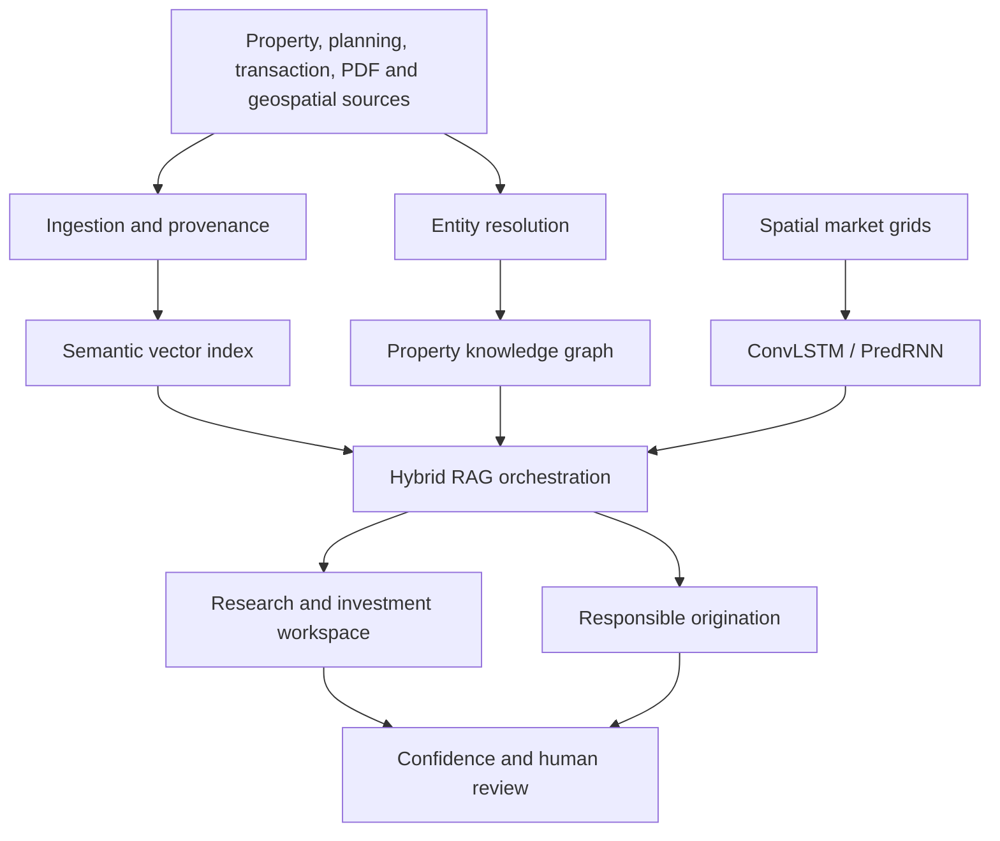

# Landmark-AI-Data

Commercial real estate intelligence that combines document evidence, market
data, a property knowledge graph and spatiotemporal forecasts in one research
and origination workspace.


> The included records and forecasts are synthetic engineering demonstrations.
> They are not investment advice, licensed market data or production model
> performance claims.

## What is implemented

| Product capability | Implementation |
|---|---|
| Large-scale collection | Upload API, R2 evidence storage, immutable SHA-256 provenance and AWS ingestion design |
| LinkedIn enrichment | Parser for authorised user exports only; no login automation or prohibited scraping |
| Email enrichment/outreach | Hunter.io adapter plus verification, lawful-basis, suppression and human-approval gates |
| RAG | Hybrid vector similarity and property-graph relationship bonus with exact evidence citations |
| PDF intelligence | PyPDF extraction, page/character locators, deterministic chunks and document hashes |
| Market analytics | Interactive asset map, opportunity scores, market momentum and investment-research views |
| Geospatial prediction | Working PyTorch ConvLSTM and PredRNN architectures with training entry point |
| Production operations | Cloudflare Sites app, D1/R2 bindings, AWS reference infrastructure and GitHub Actions |

## Architecture



The live application uses a Cloudflare-compatible Next.js runtime. The
`services/` directory contains the AWS/Python production service implementations
for ingestion, enrichment, hybrid retrieval and forecasting.

## Run the workspace

Requirements: Node.js 22.13+ and pnpm.

```bash
pnpm install
pnpm run dev
```

Build and test:

```bash
pnpm run build
node --test tests/rendered-html.test.mjs
```

Generate D1 migrations after changing `db/schema.ts`:

```bash
pnpm run db:generate
```

## Python forecasting services

```bash
python -m venv .venv
source .venv/bin/activate
pip install -r services/requirements.txt
python services/ml/train.py \
  --data data/london_quarterly_grids.pt \
  --model predrnn \
  --epochs 30 \
  --out services/ml/artifacts
```

Expected tensor shapes:

- inputs: `[samples, observed_periods, channels, height, width]`
- targets: `[samples, forecast_periods, output_channels, height, width]`

Recommended channels are rent index, vacancy, take-up, new supply, planning
intensity and anonymised mobility. Train, validation and test splits must be
time-based to prevent future leakage.

## REST surface

| Method | Endpoint | Purpose |
|---|---|---|
| `POST` | `/api/ask` | Evidence-backed hybrid RAG question answering |
| `GET/POST` | `/api/documents` | List or ingest research documents |
| `GET` | `/api/graph?propertyId=ARG-01` | Property relationship subgraph |
| `POST` | `/api/forecast` | ConvLSTM/PredRNN forecast contract |
| `POST` | `/api/outreach` | Policy-gated outreach decision |

Example RAG request:

```bash
curl -X POST http://localhost:3000/api/ask \
  -H 'content-type: application/json' \
  -d '{
    "propertyId": "ARG-01",
    "question": "Why is The Arches a high-conviction opportunity?"
  }'
```

Every citation includes a source locator, exact quote and source hash.

## Data acquisition policy

- Use licensed feeds, public records, authorised APIs and customer-owned files.
- LinkedIn data is accepted only through an authorised API or an export
  supplied by the account holder. The repository contains no credential
  automation, access-control bypass or page-scraping implementation.
- Hunter.io results are treated as leads, not consent. Outreach remains blocked
  until email verification, lawful-basis review, suppression and frequency
  checks pass.
- A human must approve all outbound messages.
- Apply UK GDPR, PECR, CAN-SPAM and local requirements as applicable.

## AWS production mapping

- S3: source documents, raw feeds and forecast grids
- Textract: scanned PDF and image OCR
- EventBridge / Step Functions: ingestion orchestration
- RDS PostgreSQL + pgvector: evidence and semantic retrieval
- Amazon Neptune or managed Neo4j: property knowledge graph
- SageMaker: ConvLSTM/PredRNN training, registry and inference
- ECS/Fargate: Python APIs and enrichment workers
- Secrets Manager: provider credentials
- CloudWatch: logs, drift metrics and operational alarms

See [docs/ARCHITECTURE.md](docs/ARCHITECTURE.md) and
[docs/MODEL_GOVERNANCE.md](docs/MODEL_GOVERNANCE.md).

## Security

Never commit provider keys, licensed datasets, personal data or model artefacts
containing raw customer records. Use workspace-hosted runtime variables or AWS
Secrets Manager. See [SECURITY.md](SECURITY.md).

## Licence

MIT. Third-party data and model weights retain their own licences.

