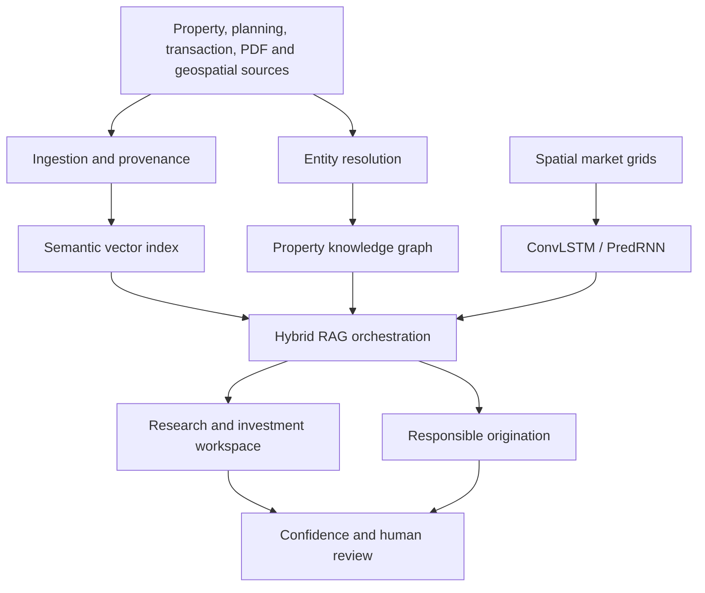

# Landmark-AI-Data-Search

Commercial real estate intelligence that combines document evidence, market
data, a property knowledge graph and spatiotemporal forecasts in one research
and origination workspace.


> The included records and forecasts are synthetic engineering demonstrations.
> They are not investment advice, licensed market data or production model
> performance claims.

## Try the application

[](https://swapnilkumar08.github.io/AI-Powered-Commercial-Real-Estate-Intelligence-platform/)

Explore the permanent static site here: [Landmark AI website](https://swapnilkumar08.github.io/AI-Powered-Commercial-Real-Estate-Intelligence-platform/)

The interactive workspace is available at: [Landmark AI workspace](https://swapnilkumar08.github.io/AI-Powered-Commercial-Real-Estate-Intelligence-platform/workspace/)

If you prefer to run it locally, use:

```bash
pnpm install
pnpm run dev
```

## What is implemented

| Product capability | Implementation |
|---|---|
| Large-scale collection | Upload API, R2 evidence storage, immutable SHA-256 provenance and AWS ingestion design |
| LinkedIn enrichment | Parser for authorised user exports only; no login automation or prohibited scraping |
| Email enrichment/outreach | Hunter.io adapter plus verification, lawful-basis, suppression and human-approval gates |
| RAG | Hybrid vector similarity and property-graph relationship bonus with exact evidence citations |
| PDF intelligence | PyPDF extraction, page/character locators, deterministic chunks and document hashes |
| Market analytics | Interactive multi-country asset map, opportunity scores, market momentum and investment-research views |
| Geospatial prediction | Working PyTorch ConvLSTM and PredRNN architectures with training entry point |
| Production operations | Cloudflare Sites app, D1/R2 bindings, AWS reference infrastructure and GitHub Actions |

## Architecture



The live application uses a Cloudflare-compatible Next.js runtime. The
`services/` directory contains the AWS/Python production service implementations
for ingestion, enrichment, hybrid retrieval and forecasting.

## Country intelligence coverage

The workspace now includes a country selector with integrated datasets for:

- Afghanistan
- Bangladesh
- Bhutan
- India
- Pakistan
- Sri Lanka

## Run the workspace

Requirements: Node.js 22.13+ and pnpm.

```bash
pnpm install
pnpm run dev
```

Build and test:

```bash
pnpm run build
node --test tests/rendered-html.test.mjs
```

Build the static GitHub Pages site locally:

```bash
pnpm run build:pages
```

## Deploy to GitHub Pages

This repository includes [.github/workflows/nextjs.yml](.github/workflows/nextjs.yml), which builds a static export and publishes it to GitHub Pages.

To enable the permanent site:

1. Push the repository to GitHub.
2. Open Settings -> Pages.
3. Set Source to GitHub Actions.
4. Push to `main` or run the `deploy-pages` workflow manually.

The published URL for this repository is:

`https://swapnilkumar08.github.io/AI-Powered-Commercial-Real-Estate-Intelligence-platform/`

The Pages deployment is a static demo build. The Cloudflare runtime APIs under `app/api/` are excluded from the Pages export, so the permanent site preserves the UI and demo flows while the full server-backed runtime remains available for Cloudflare-style deployments.

Generate D1 migrations after changing `db/schema.ts`:

```bash
pnpm run db:generate
```

## Python forecasting services

```bash
python -m venv .venv
source .venv/bin/activate
pip install -r services/requirements.txt
python services/ml/train.py \
  --data data/london_quarterly_grids.pt \
  --model predrnn \
  --epochs 30 \
  --out services/ml/artifacts
```

Expected tensor shapes:

- inputs: `[samples, observed_periods, channels, height, width]`
- targets: `[samples, forecast_periods, output_channels, height, width]`

Recommended channels are rent index, vacancy, take-up, new supply, planning
intensity and anonymised mobility. Train, validation and test splits must be
time-based to prevent future leakage.
